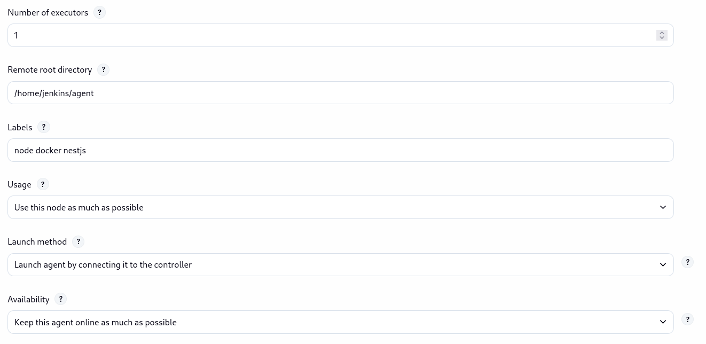
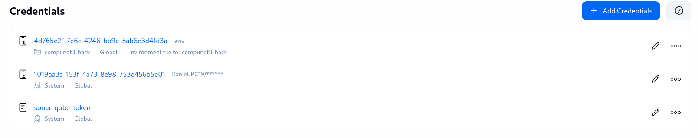
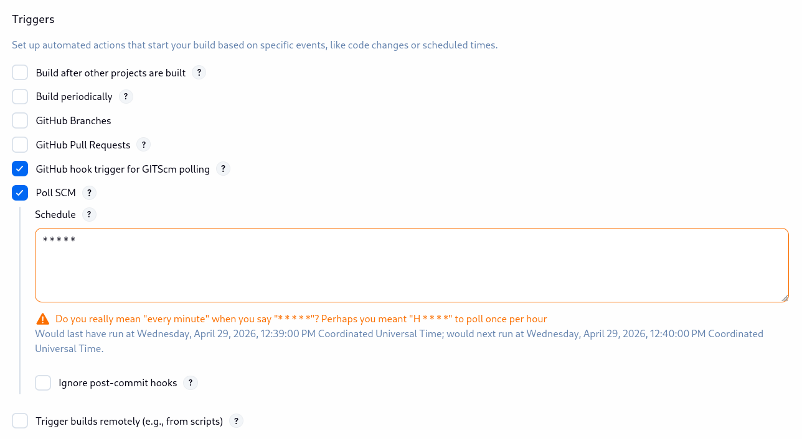
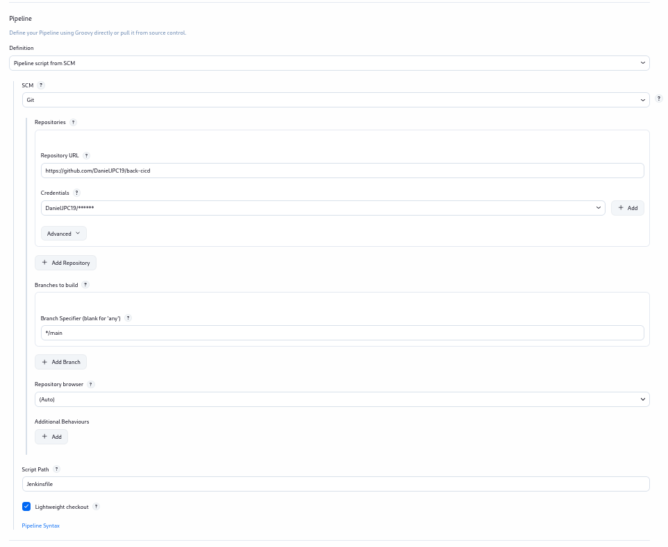
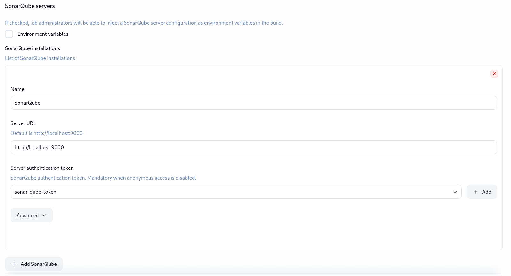
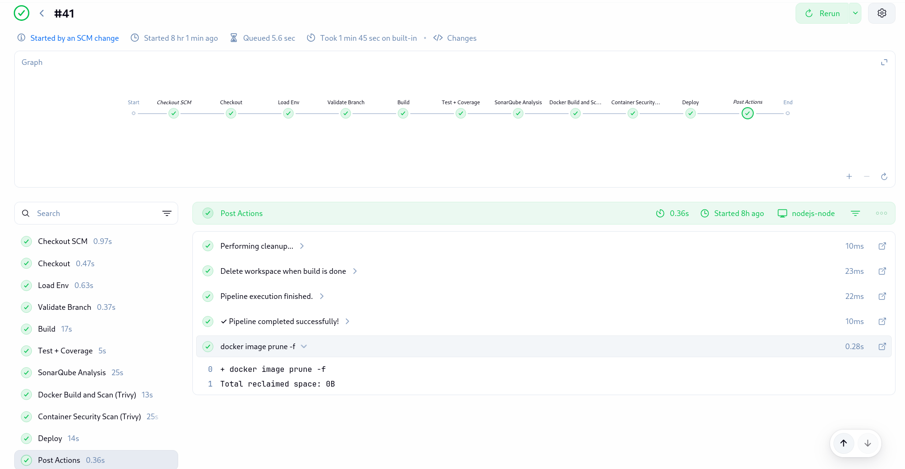
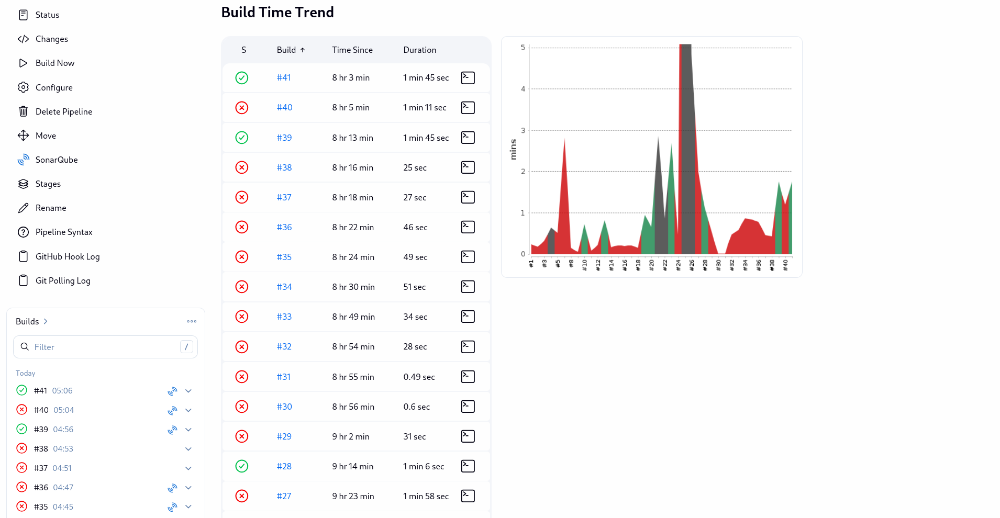

# Ejercicio de Diseño y Construcción de Pipelines

## Repositorio

Enlace al repositorio:

https://github.com/DanielJPC19/back-cicd.git

## Información de los Estudiantes

- Angela Maria Gonzalez Cordoba - A00399435
- Daniel Jose Plazas Cortes - A00400085

## Definición del Pipeline

Para nuestro ejercicio, realizamos la definición de 11 etapas, siendo estas definidas en el siguiente archivo Jenkinsfile:

```bash
pipeline {
    environment {
        IMAGE_NAME = 'compunet3-back'
    }
    agent { label 'node docker nestjs' }

    stages {
        stage('Checkout') {
            // Checkout code from repository
            steps {
                echo 'Checking out code from repository...'
                checkout scm
            }
        }
        stage('Load Env') {
            steps {
                echo 'Loading environment variables...'
                withCredentials([file(credentialsId: '4d765e2f-7e6c-4246-bb9e-5ab6e3d4fd3a', variable: 'ENV_FILE')]) {
                    sh 'cp $ENV_FILE .env'
                    sh 'cat .env | wc -l' // Verify that the .env file has been loaded
                }
            }
        }
        stage('Validate Branch') {
            steps {
                script {
                    def branch = sh(
                        script: 'git rev-parse --abbrev-ref HEAD',
                        returnStdout: true
                    ).trim()

                    echo "Current branch: ${branch}"

                    if (branch != 'main' && branch != 'HEAD') {
                        error("Build aborted: this job only runs on 'main', current branch is '${branch}'.")
                    }

                    echo 'Branch is main. Proceeding...'
                }
            }
        }
        stage('Build') {
            // Build the application
            steps {
                echo 'Building the application...'
                sh 'npm ci'
                sh 'npm run build'
            }
        }
        stage('Test + Coverage') {
            // Run tests
            steps {
                echo 'Running tests...'
                sh 'npm run test:cov'
            }
        }
        stage('SonarQube Analysis') {
            // Static code analysis with quality gate
            steps {
                echo 'Running SonarQube analysis...'
                withSonarQubeEnv('SonarQube') {

                    script {
                        sh '''
                            npx sonar-scanner \
                                -Dsonar.projectKey=compunet3-back \
                                -Dsonar.sources=src \
                                -Dsonar.host.url=http://sonarqube:9000 \
                        '''

                        // Check for Security Hotspots
                        echo 'Checking for Security Hotspots...'
                        def hotspotsResponse = sh(
                            script: '''
                                curl -s "http://sonarqube:9000/api/hotspots/search?projectKey=compunet3-back&status=TO_REVIEW" | grep -o '"total":[0-9]*' | cut -d':' -f2
                            ''',
                            returnStdout: true
                        ).trim()

                        def hotspots = hotspotsResponse.isEmpty() ? 0 : hotspotsResponse.toInteger()

                        if (hotspots > 0) {
                            error("SonarQube found ${hotspots} Security Hotspot(s). Please review and fix them before deploying.")
                        } else {
                            echo "No Security Hotspots found. Proceeding with deployment..."
                        }
                    }
                }
            }
        }
        stage('Docker Build and Scan (Trivy)') {
            // Build Docker Image
            steps {
                echo 'Building Docker image...'
                sh 'docker build -t ${IMAGE_NAME}:latest .'
            }
        }
        stage('Container Security Scan (Trivy)') {
            // Container security scan with quality gate
            steps {
                echo 'Scanning Docker image for vulnerabilities...'
                script {
                    // First scan: report all vulnerabilities (exit-code 0)
                    sh 'docker run --rm -v /var/run/docker.sock:/var/run/docker.sock aquasec/trivy:latest image --exit-code 0 ${IMAGE_NAME}:latest'

                    // Second scan: fail if CRITICAL vulnerabilities found (exit-code 1)
                    echo 'Checking for CRITICAL vulnerabilities...'
                    sh 'docker run --rm -v /var/run/docker.sock:/var/run/docker.sock aquasec/trivy:latest image --exit-code 1 --severity CRITICAL ${IMAGE_NAME}:latest'
                }
            }
        }
        stage('Deploy') {
            // Deploy the application
            steps {
                echo 'Deploying the application...'
                sh 'docker compose down'
                sh 'docker compose up -d --build'
            }
        }
    }

    post {
        success {
            echo '✓ Pipeline completed successfully!'
            sh 'docker image prune -f' // Clean unused Docker images
        }
        failure {
            echo '✗ Pipeline failed. Please check the logs for details.'
            sh 'docker compose down || true' // Stop containers without failing
        }
        always {
            echo 'Performing cleanup...'
            cleanWs() // Clean workspace after execution
            echo 'Pipeline execution finished.'
        }
    }
}
```

## Configuración del Proyecto

En primer lugar, se toma un proyecto realizado en Computación en Internet 3 (de manera origial trabajamos 3 compañeros, los cuales fueron Daniel, Gabriel y Ricardo), y se adaptó para realizar el ejercicio con Jenkins (para este ejercicio trabajaron Angela y Daniel).

De caracter inicial, definimos una red (`docker network create jenkins-net`) de Jenkins, en dónde ubicaremos a Jenkins y el nodo, el cual tendrá una instalación para poder ejecutar node y npm. Para la configuración del nodo, creamos una imagen, la cual contiene:

```Dockerfile
FROM jenkins/inbound-agent:latest

USER root

RUN apt-get update && apt-get install -y \
    curl \
    git \
    docker.io \
    docker-compose \
    # java 21
    openjdk-21-jdk \
    && apt-get clean \
    && rm -rf /var/lib/apt/lists/*

RUN curl -fsSL https://deb.nodesource.com/setup_22.x | bash - \
 && apt-get install -y nodejs

USER jenkins
```

Y la construimos y ejecutamos como:

```bash
# Crear imagen:
docker build -t my-jenkins-agent -f Dockerfile.agent .

# Ejecutar el nodo:
docker run -d \
--name node-agent \
--network jenkins-net \
-u root \
-v /var/run/docker.sock:/var/run/docker.sock \
my-jenkins-agent \
-url http://jenkins:8080 \
# El secreto lo obtenemos de Jenkins
-secret 5b102edd060b3b9165d5aa692617bcce0021b76e7fb5837baf1d4817204cb557 \
-name nodejs-node \
-webSocket \
-workDir /home/jenkins/agent
```

Para el nodo, cuenta con la siguiente configuración:



Con esto, y con el objetivo de mantener el atributo de calidad, se hace uso de secretos en Jenkins. Creamos una carpeta, la cual va a contar con las credenciales, siendo estas:



Ya dentro de esta carpeta, creamos el pipeline, el cual cuenta con la configuración, primero del trigger, y después la relación con el Jenkinsfile y el repositorio, la cual se muestra a continuación:





Por último, realizamos la configuración de SonarQube, para lo cual, levantamos un servicio de SonarQube de manera local, haciendo uso de docker. Cabe resaltar, que este servicio se puede realizar de manera desplegada o en una máquina externa, ya que es un servicio que va a consumir Jenkins y no resulta ser un nodo relacionado. Es por esto que:

```bash
docker run -d \
--name sonarqube \
--network jenkins-net \
-p 9009:9000 \
--restart unless-stopped \
sonarqube
```

Y por último, le hacemos saber a Jenkins que va a usar a SonarQube por medio de esa dirección, siendo así:



## Ejecución del Pipeline

Como evidencia, el pipeline se ejecuta de la siguiente manera con sus etapas:



También, la evidencia para los fallos en el pipeline solicitados:



Por último, para acceder al export del job, dirígase hacia /docs/job.xml.

Para la ejecución del proyecto, tomamos el endpoint principal y obtenemos:

```bash
daniel@fedora-daniel:~/Documents/ingesoftv/ejercicio-diseno-construccion/back-cicd$ curl http://localhost:3500
Hello World!
```